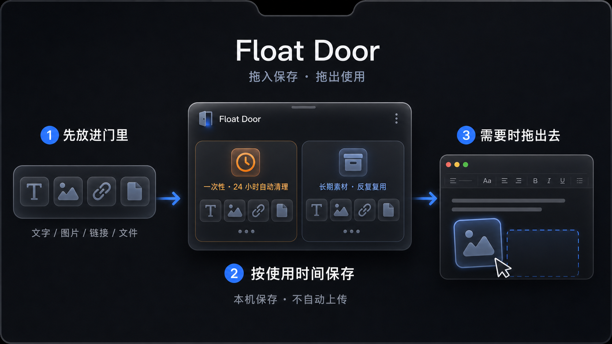

# Float Door

基于 macOS 刘海/顶部中央区域的本地内容暂存工具。支持一次性内容、长期素材和一个可重命名的自定义区域；浏览器扩展和 ChatGPT 投递按文档顺序留给后续阶段。

## 下载

普通用户可以从 [GitHub Releases](../../releases) 下载最新 DMG。开发者可以直接克隆仓库并使用 Swift Package Manager 构建。

## 怎么使用

核心路径是“来源 → Float Door → 当前窗口”：先从其他应用拖入内容，临时内容放入“一次性”区域（默认 24 小时后清理），常用内容放入“长期素材”；需要时展开顶部入口，再把卡片拖到当前窗口。Float Door 只做本地暂存，不自动上传或同步云端。

## 当前目录结构

    Package.swift
    Sources/FloatDoor/
      App/             启动入口、生命周期与依赖组装
      Domain/          领域模型和不依赖 UI 的业务规则
      Application/     应用状态、用例与外部能力协议
      Infrastructure/  磁盘、拖放、剪贴板和拖出适配器
      Presentation/    刘海面板、Portal 界面与设置
    Tests/FloatDoorTests/
    docs/ARCHITECTURE.md
    docs/PANEL_CLICK_HANDLING.md

详细的依赖边界和功能扩展方式见 [架构说明](docs/ARCHITECTURE.md)。刘海面板的 first mouse、原生点击热区及本次故障复盘见 [面板点击事件处理](docs/PANEL_CLICK_HANDLING.md)。

## 阶段一功能

- 菜单栏应用和顶部中央无边框面板；有/无刘海显示器均可使用。
- 一次性与长期素材两个保存范围，长期区域包含一个可重命名的自定义内容区域。
- 文本、URL、图片、文件和多文件的拖入；菜单可保存当前剪贴板。
- 拖出的文本、URL 与文件可供其他应用接收。
- 文件复制到 Application Support/FloatDoor 下的 Temporary、Permanent 或 Custom 目录，元数据保存为本地 JSON。
- 一次性内容默认 24 小时过期，可转为长期素材、删除和手动清空。
- 长期素材可重命名、删除和拖出。

## 实现方案

### 主要数据模型

- PortalItem：一次性和长期素材的统一对象，保存类型、文本/URL、缓存文件相对路径、文件大小、创建时间和过期时间。
- StorageScope：temporary、permanent 或 custom。只有 temporary 计算默认过期时间；custom 使用独立的 Custom 文件目录，避免与长期素材混放。
- SavedPrompt 和 PromptDraft：按需求文档保留为阶段二的独立模型，不将拖入的 Prompt 正文误存为普通素材。

### 刘海窗口

应用采用 accessory 菜单栏形态，并使用无边框、nonactivating、floating 的 NSPanel 锚定在当前屏幕顶部中央。点击面板外区域会触发收起。收起时面板缩入刘海并完全隐藏，但顶部中央会保留透明命中区；悬停、点击或向该区域拖放内容会再次展开。无刘海显示器使用相同的顶部中央退化位置；全屏空间使用 fullScreenAuxiliary。

### 拖放与本地存储

导入按文件 URL、网页 URL、图片、文本的顺序识别，支持多个 provider。系统拖放提供的临时文件会先进入短生命周期的暂存目录，再复制到 Application Support/FloatDoor/Temporary 或 Permanent；元数据写入 Database/portal-items.json。应用不会长期依赖原文件路径，也不会读取完整剪贴板历史。

拖出时文本提供 plain text，链接提供 URL，图片和文件提供原始文件表示。删除、转长期和启动时过期清理都会同步更新 JSON 与缓存文件。

### 后续 Prompt 与 ChatGPT 方案

后续如需增加 Prompt 草稿、浏览器扩展和 ChatGPT 投递，应继续与当前自定义区域的普通内容存储解耦。阶段四再单独增加 Manifest V3 Chrome 扩展和 Native Messaging 协议，限定在 chatgpt.com 处理用户主动投递的数据，避免让浏览器集成耦合到本地存储层。

### 主要技术风险

- 不同来源应用提供的拖放类型不同，因此对无法读取的 provider 显示明确错误并保留剪贴板导入作为回退。
- 浏览器页面输入框和上传 DOM 会变化，因此 ChatGPT 投递必须具备扩展状态、页面识别、重试和复制文本回退。
- 原始文件可在导入后移动或删除，所以应用始终使用自己复制的文件副本。

## 运行与测试

要求 macOS 14+、Xcode 26 / Swift 6：

    swift run FloatDoor
    swift test

运行后点击菜单栏的门图标，或悬停/点击顶部中央的透明刘海命中区展开 Float Door 。将内容拖到“一次性”或“长期素材”区域即可保存。

## 存储与隐私

所有内容只保存在本机。文件会被复制到应用自己的 Application Support 目录，而非长期引用原始路径；应用不自动读取剪贴板历史或其他应用输入。

## 协议

Float Door 采用 [PolyForm Noncommercial License 1.0.0](LICENSE)。允许个人学习、研究、修改及其他非商业用途；协议没有授予商业使用权。

本项目属于“非商业源码可用”项目，不是 OSI 定义的开源软件。复制或分发项目时必须一并保留完整协议和 Required Notice。

## 参与贡献

欢迎提交 Issue 和 Pull Request。开始前请阅读 [CONTRIBUTING.md](CONTRIBUTING.md)；安全问题请遵循 [SECURITY.md](SECURITY.md) 的私密报告方式。

## 下一阶段

后续阶段再接入更专门的 Prompt 草稿、浏览器扩展和 ChatGPT Chrome 扩展能力。
